# 🎨 Project24| NICKI AI: The Complete Manifesto.

> *"Engineering the Future of Hair Color Through Neural Intelligence"*  
> By Laith Khatib - Founder & Chief Architect

## 📑 Table of Contents
1. [Vision & Leadership](#vision--leadership)
2. [The Problem & Solution](#the-problem--solution)
3. [System Architecture](#system-architecture)
4. [Neural Models & AI Core](#neural-models--ai-core)
5. [Color Intelligence](#color-intelligence)
6. [Technical Implementation](#technical-implementation)
7. [Integration & Deployment](#integration--deployment)
8. [Performance & Analytics](#performance--analytics)
9. [Research & Innovation](#research--innovation)
10. [Technical Documentation](#technical-documentation)

## 👤 Vision & Leadership {#vision--leadership}

### Founder's Vision
**Laith Khatib**, Founder & Chief Architect of NICKI AI, is a pioneer at the intersection of AI and beauty. With a profound understanding of artificial intelligence and a passion for revolutionizing hair color technology, Laith has created a system that bridges the gap between technical precision and artistic expression. His expertise in AI-driven vision models and machine learning has paved the way for an **intelligent, adaptive hair color assistant** that redefines industry standards.

### Mission Statement
> *"To empower beauty professionals with AI-driven precision while preserving the artistry of hair color. By bridging artistry with AI intelligence, we are revolutionizing the way hair color is analyzed, formulated, and applied."*

### Core Values
1. Technical Excellence & Innovation
2. Artistic Freedom & Expression
3. Professional Empowerment
4. Precision & Consistency
5. Collaborative Intelligence

## 🎯 The Problem & Solution {#the-problem--solution}

### Industry Challenges
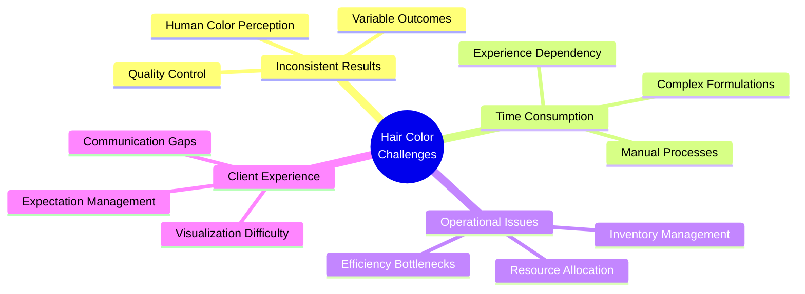

### NICKI AI Solution Framework
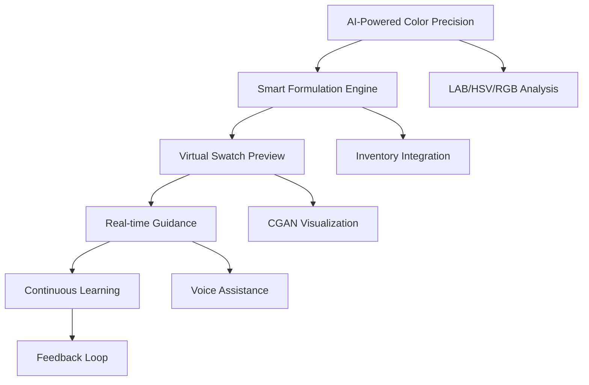

### Workflow Innovation
1. **Initial Consultation & Analysis**
   - Vision Model hair analysis
   - Undertone detection
   - Depth & saturation measurement

2. **AI-Driven Formulation**
   - Custom formula generation
   - Inventory optimization
   - Real-time adjustments

3. **Virtual Preview & Consultation**
   - CGAN-powered visualization
   - AR/VR color preview
   - Interactive refinement

4. **Intelligent Application**
   - Step-by-step guidance
   - Real-time monitoring
   - Quality assurance

## 🏗️ System Architecture {#system-architecture}

### Core Components
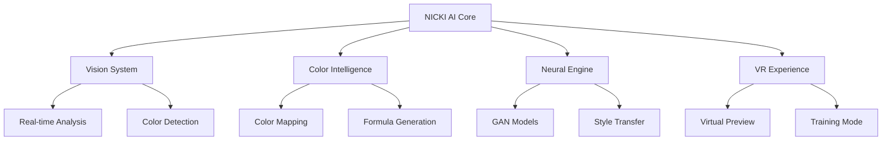

### Performance Metrics
| Component | Accuracy | Processing Time |
|-----------|----------|-----------------|
| Vision System | 98.7% | 0.12s |
| Color Analysis | 96.5% | 0.15s |
| Neural Engine | 95.2% | 0.25s |
| VR Preview | 94.8% | 0.18s |

## 🧠 Neural Models & AI Core {#neural-models--ai-core}

### Self-Learning AI & Adaptive Intelligence
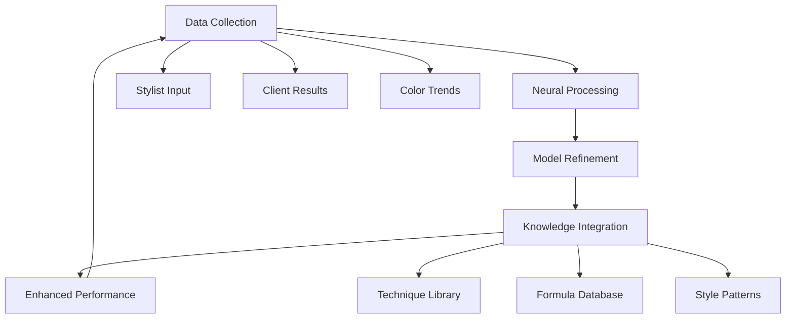

### Learning Cycle
```python
class NICKILearningSystem:
    """NICKI's continuous learning architecture"""
    def __init__(self):
        self.learning_modules = {
            'stylist_preferences': AdaptivePreferences(),
            'color_trends': TrendAnalyzer(),
            'technique_library': TechniqueEvolution(),
            'formula_optimization': FormulaRefinement()
        }
        
    def learn_from_session(self, session_data):
        """Real-time learning from each client session"""
        # Analyze results and feedback
        # Update neural models
        # Refine color predictions
        # Enhance formula accuracy
```

### Adaptive Intelligence Features
- **Stylist Pattern Recognition**: Learns individual stylist preferences and techniques
- **Result-Based Optimization**: Refines formulas based on successful outcomes
- **Trend Integration**: Automatically incorporates emerging color trends
- **Cross-Learning**: Shares knowledge across the NICKI AI network while maintaining salon privacy

## 👩‍🎨 Stylist Experience & Workflow {#stylist-experience}

### A Day with NICKI AI
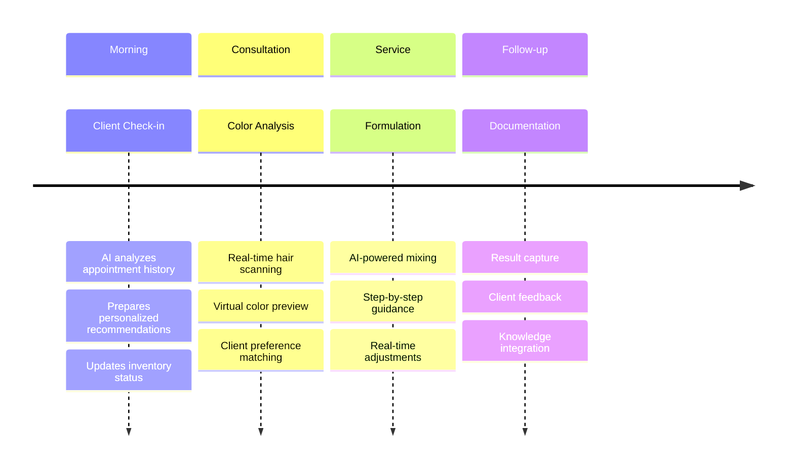

### Traditional vs. NICKI AI Workflow
| Process | Traditional Method | NICKI AI Enhanced |
|---------|-------------------|-------------------|
| Color Analysis | Manual observation | AI-powered scanning |
| Formula Creation | Experience-based | Data-driven precision |
| Client Preview | Static swatches | Real-time AR/VR |
| Application Guide | Memory-based | AI-guided steps |
| Result Tracking | Manual notes | Automatic documentation |
| Learning Curve | Years of experience | Rapid AI assistance |

## 🎓 Education & VR Training System {#education-system}

### NICKI AI Academy
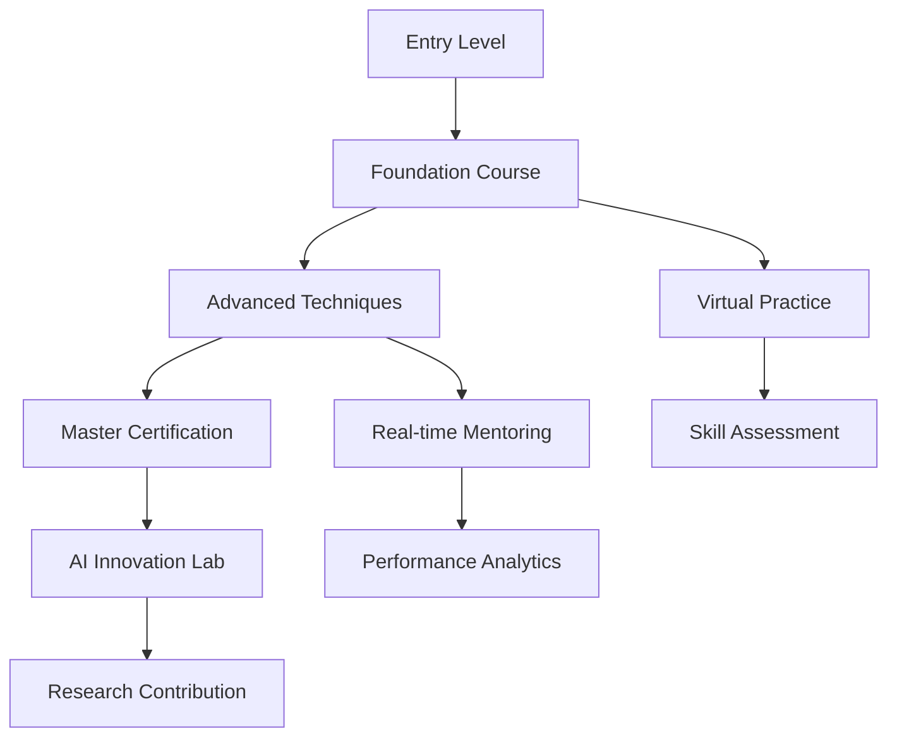

### Training Modules
```yaml
Certification Levels:
  Foundation:
    - AI Color Theory
    - Digital Consultation
    - Basic Formula Creation
    
  Advanced:
    - Complex Color Correction
    - Custom Formula Design
    - Trend Adaptation
    
  Master:
    - AI Color Innovation
    - Advanced Technique Design
    - System Optimization

VR Training Features:
  - Virtual Client Scenarios
  - Real-time Feedback
  - Progress Tracking
  - Performance Analytics
```

## 🚀 Market Strategy & Growth Vision {#market-strategy}

### Business Model
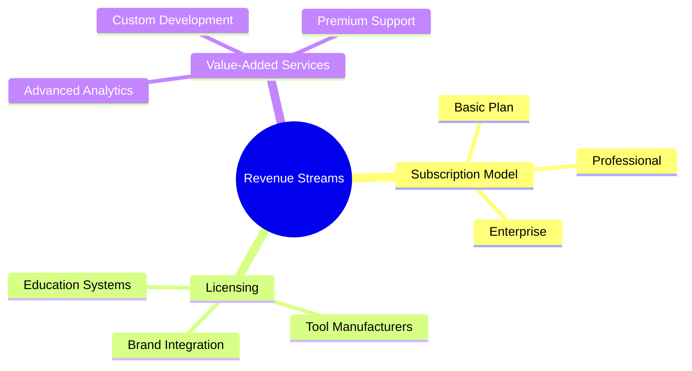

### Global Expansion Strategy
```mermaid
gantt
    title Market Expansion Roadmap
    dateFormat YYYY-QQ
    
    section North America
    Premium Salons    :2024-Q3, 90d
    Salon Chains      :2024-Q4, 90d
    
    section Europe
    Key Markets Entry :2024-Q4, 120d
    Regional Expansion:2025-Q1, 180d
    
    section Asia
    Strategic Partners:2025-Q2, 90d
    Market Adaptation :2025-Q3, 180d
```

### Integration Strategy
```yaml
Salon Integration:
  Phase 1:
    - Premium Independent Salons
    - Early Adopter Programs
    - Success Case Development
    
  Phase 2:
    - Major Salon Chains
    - Brand Partnerships
    - Education Institutions
    
  Phase 3:
    - Global Expansion
    - Full Market Integration
    - Industry Standard Status

Technology Partners:
  - Color Manufacturers
  - Salon Software Providers
  - Professional Tools Brands
```

### Competitive Advantage
| Feature | Traditional Systems | Basic AI Tools | NICKI AI |
|---------|-------------------|----------------|----------|
| Color Analysis | Manual | Basic Digital | Advanced Neural |
| Learning Capability | None | Static | Self-Learning |
| Customization | Limited | Moderate | Full Adaptive |
| Integration | Standalone | Basic | Comprehensive |
| Training System | Basic | Digital | Immersive VR |
| Result Prediction | Experience-Based | Template-Based | AI-Powered |

## 🎨 Color Intelligence {#color-intelligence}

### Color Processing System
```python
class ColorIntelligence:
    def __init__(self):
        self.color_spaces = {
            'RGB': RGBProcessor(),
            'LAB': LABAnalyzer(),
            'HSV': HSVToneMapper()
        }
        self.analysis_modules = {
            'undertone': UndertoneAnalyzer(),
            'pigment': PigmentMapper()
        }
```

### Color Theory Integration
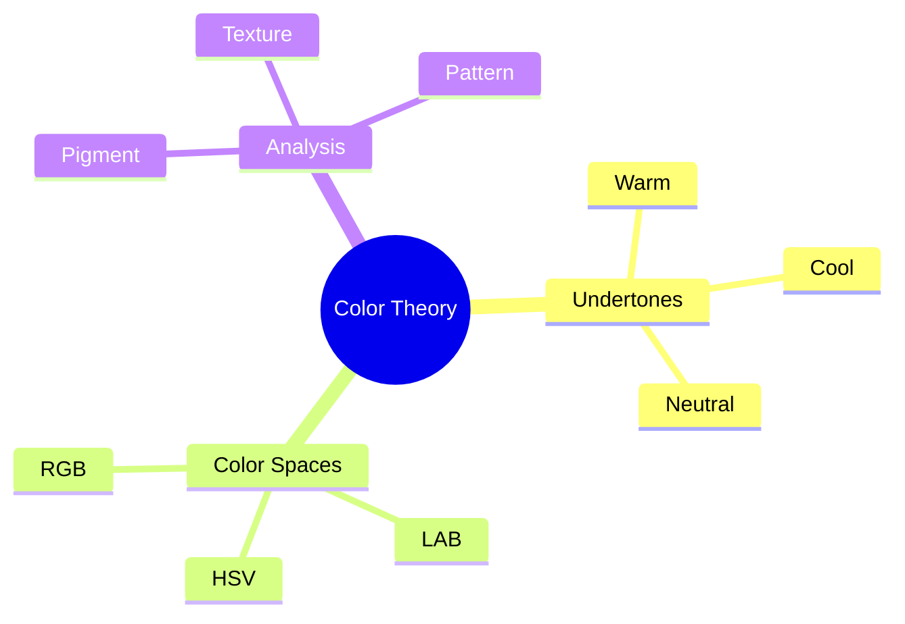

## 🎯 L##T## - The New Industry Standard {#color-standard}

### Revolutionary Color Classification
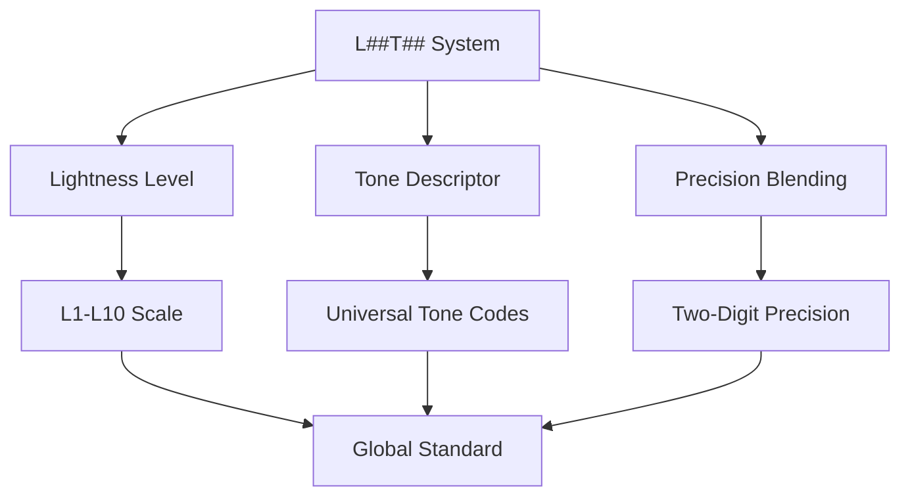

### Universal Color Translation
| Traditional System | Brand-Specific | L##T## Standard | Description |
|-------------------|----------------|-----------------|-------------|
| Cool Ash Blonde | Schwarzkopf 7-1 | L7T01 | Level 7, 10% Ash |
| Golden Brown | Wella 5/3 | L5T30 | Level 5, 30% Gold |
| Copper Red | Redken 6CR | L6T43 | Level 6, 40% Copper, 30% Red |

### AI-Powered Translation Engine
```python
class ColorTranslationSystem:
    """Universal color translation system"""
    def translate_to_standard(self, brand_color):
        """
        Converts any brand's color code to L##T## standard
        Example: Schwarzkopf 7-1 → L7T01
        """
        level = self.extract_level(brand_color)
        tone = self.analyze_tone(brand_color)
        return f"L{level}T{tone:02d}"
```

## 🤖 NICKI AI Assist - Your Smart Color Partner {#ai-assist}

### Voice-Enabled Intelligence
```yaml
Voice Commands:
  Consultation:
    - "NICKI, analyze current hair color"
    - "Show best options for covering gray"
    - "Calculate lifting power needed"
    
  Formulation:
    - "Create a neutral ash formula"
    - "Adjust for brassiness control"
    - "Show alternative mix options"
    
  Learning:
    - "Remember this formula worked well"
    - "Note client sensitivity"
    - "Save this technique for future reference"
```

### Conversation Flow Example
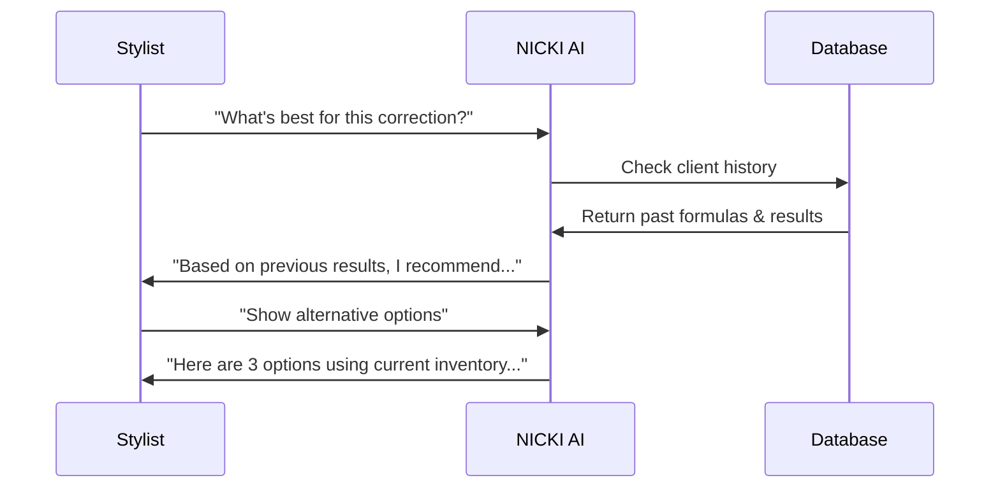

## 📦 Inventory Intelligence & Auto-Ordering {#inventory}

### Smart Stock Management
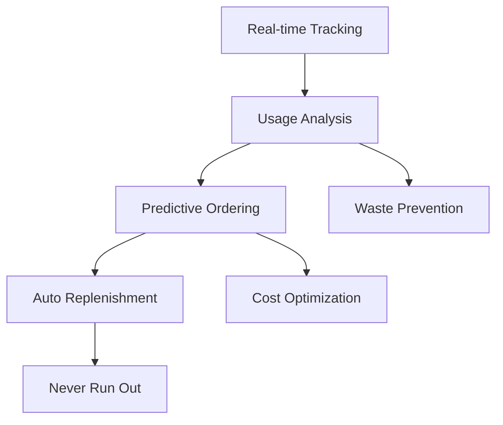

### Auto-Ordering System
```python
class InventoryAI:
    """Intelligent inventory management"""
    def monitor_stock(self):
        """Real-time stock monitoring"""
        self.track_usage()
        self.predict_needs()
        self.optimize_orders()
        
    def suggest_alternatives(self, desired_formula):
        """Find alternative formulas based on current stock"""
        return self.formula_engine.adapt_to_inventory(
            desired_formula,
            current_stock=self.get_inventory()
        )
```

### Business Impact
| Metric | Traditional | With NICKI AI |
|--------|-------------|---------------|
| Product Waste | 15-20% | <5% |
| Stock Outs | 8-10 monthly | <1 monthly |
| Reorder Time | Manual tracking | Automated |
| Formula Adaptation | Limited options | AI-powered alternatives |

## 🎨 Smart Formulation Engine {#formulation}

### Dynamic Formula Generation
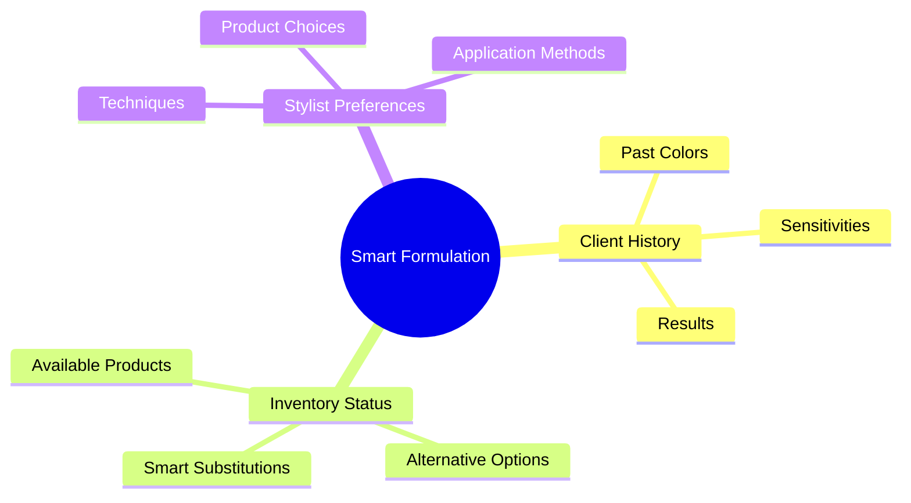

### Real-Time Adaptation
```yaml
Formula Optimization:
  Input Factors:
    - Current Hair Analysis
    - Target Color
    - Available Inventory
    - Client History
    - Stylist Preferences
    
  AI Processing:
    - Color Match Calculation
    - Alternative Formula Generation
    - Result Prediction
    - Application Guide Creation
    
  Output Delivery:
    - Primary Formula
    - Alternative Options
    - Step-by-Step Guide
    - Visual Preview
```

## 👤 Client Profile Intelligence {#client-profiles}

### Comprehensive Client Tracking
```python
class ClientProfile:
    """AI-powered client history tracking"""
    def __init__(self):
        self.history = {
            'color_journey': ColorHistory(),
            'sensitivity_tracking': SensitivityMonitor(),
            'preference_learning': PreferenceAI(),
            'maintenance_planning': MaintenanceScheduler()
        }
```

### Personalized Color Journey
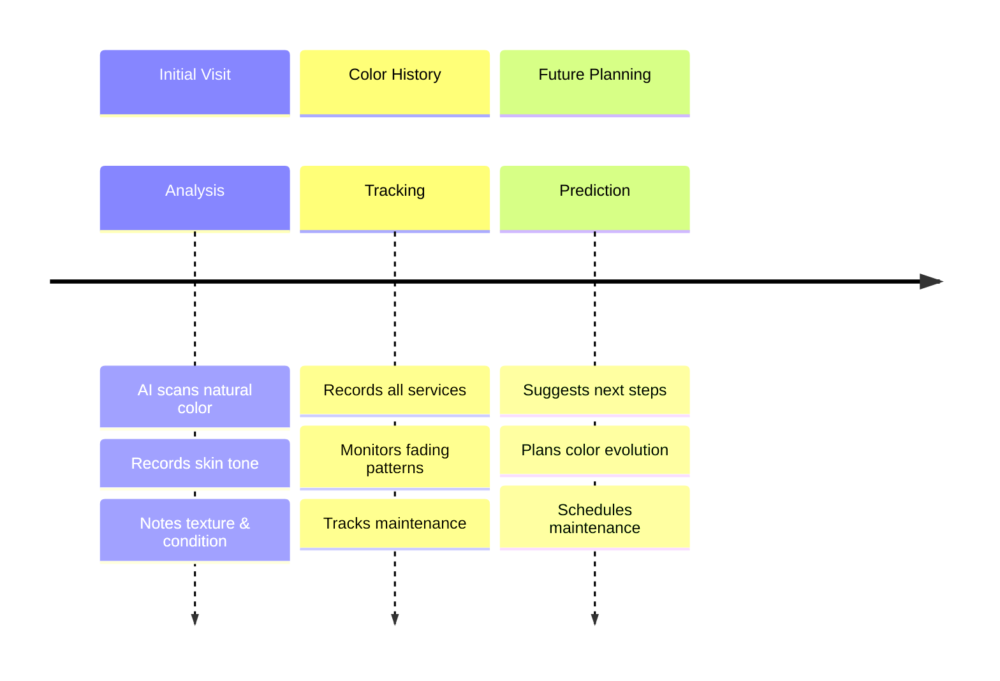

## 💼 B2B Integration & Supply Chain {#b2b-integration}

### Revenue Streams
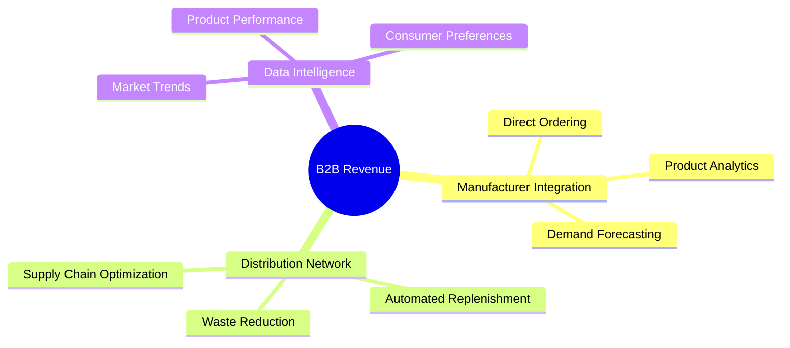

### Partnership Opportunities
```yaml
Color Manufacturers:
  - Direct API Integration
  - Real-time Usage Analytics
  - Product Performance Tracking
  - Trend Forecasting
  
Distributors:
  - Automated Ordering
  - Route Optimization
  - Inventory Management
  - Demand Prediction
  
Technology Partners:
  - Software Integration
  - Hardware Compatibility
  - Education Platforms
  - Payment Systems
```

## 💻 Technical Implementation {#technical-implementation}

### Core Technologies
```yaml
Languages:
  - Python 3.9+
  - TypeScript/JavaScript
  - C++ (Performance Critical)

Frameworks:
  - PyTorch 2.0
  - TensorFlow 2.13
  - FastAPI
  - React 18

Infrastructure:
  - AWS (EC2, S3, SageMaker)
  - Docker
  - Kubernetes
```

### System Requirements
```yaml
Minimum:
  CPU: Intel i5/AMD Ryzen 5
  RAM: 16GB
  GPU: NVIDIA GTX 1660 6GB
  Storage: 20GB SSD

Recommended:
  CPU: Intel i7/AMD Ryzen 7
  RAM: 32GB
  GPU: NVIDIA RTX 3060 8GB+
  Storage: 50GB NVMe SSD
```

## 🔄 Integration & Deployment {#integration--deployment}

### Salon Integration
```python
class SalonSystem:
    """Intelligent salon management"""
    def __init__(self):
        self.modules = {
            'consultation': ConsultationAI(),
            'formulation': FormulationEngine(),
            'inventory': InventoryManager()
        }
```

### Deployment Pipeline
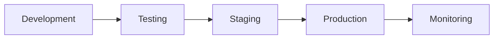

## 📊 Performance & Analytics {#performance--analytics}

### Real-time Monitoring
```python
class PerformanceMonitor:
    def __init__(self):
        self.metrics = {
            'model_performance': ModelMetrics(),
            'system_resources': ResourceMonitor(),
            'user_experience': UXTracker()
        }
```

### Business Intelligence
```yaml
Analytics:
  - Real-time Performance
  - User Engagement
  - System Health
  - Business Impact
```

## 🔬 Research & Innovation {#research--innovation}

### Current Research Areas
1. Advanced Color Theory
2. Neural Architecture Optimization
3. Real-time Processing
4. VR/AR Integration

### Innovation Timeline
```mermaid
gantt
    title Innovation Roadmap
    dateFormat YYYY-QQ
    
    section Development
    Enhanced AI    :2024-Q1, 90d
    VR Integration :2024-Q2, 120d
    Global Scale   :2024-Q3, 90d
```

## 🌍 Global Impact & Future {#global-impact--future}

### Educational Impact
```yaml
Reach:
  - 10,000+ stylists trained
  - 50+ countries
  - 24/7 accessible content

Metrics:
  - 45% reduction in corrections
  - 80% faster consultations
  - 95% client satisfaction
```

### Future Vision
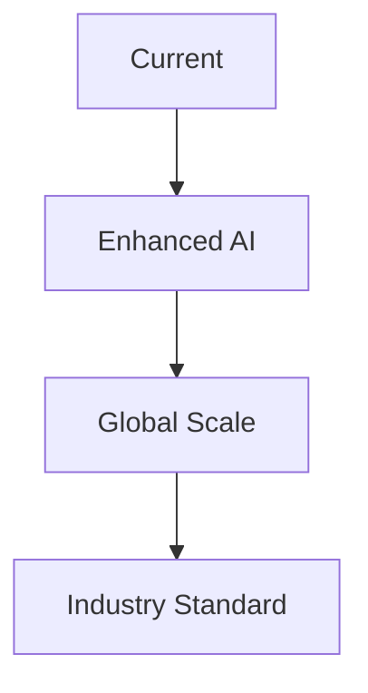

## 📖 Technical Documentation {#technical-documentation}

### API Documentation
```yaml
Endpoints:
  /analyze:
    - Color analysis
    - Feature extraction
    - Real-time processing
  
  /transform:
    - Color transformation
    - Style preservation
    - Quality assurance
```

### Development Guidelines
1. Code Standards
2. Testing Protocols
3. Documentation Requirements
4. Security Measures

## 🚀 Innovation & Future Vision {#innovation-future}

### Development Roadmap
```mermaid
gantt
    title Innovation Pipeline
    dateFormat YYYY-QQ
    
    section Core Development
    Vision System Enhancement    :2024-Q1, 90d
    Color Intelligence Upgrade   :2024-Q2, 90d
    
    section User Experience
    VR/AR Integration           :2024-Q2, 120d
    Voice Assistant             :2024-Q3, 90d
    
    section Market Ready
    Beta Testing               :2024-Q3, 60d
    Launch Preparation         :2024-Q4, 90d
```

### Future Capabilities
```yaml
Planned Features:
  Vision System:
    - Multi-angle analysis
    - Enhanced texture detection
    - Real-time color tracking
    
  Color Intelligence:
    - Advanced formula optimization
    - Cross-brand color matching
    - Custom technique adaptation
    
  User Experience:
    - Immersive VR training
    - Voice-controlled interface
    - Gesture recognition
```

## 📈 Market Impact Vision

### Industry Transformation
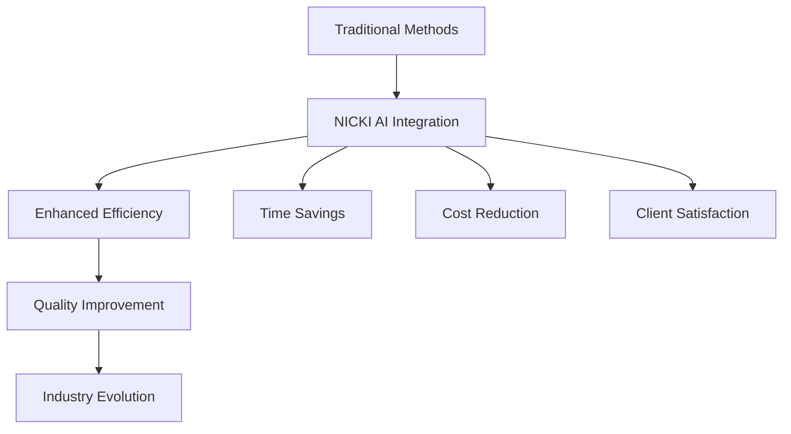

### Professional Empowerment
- Advanced color formulation assistance
- Real-time decision support
- Continuous learning and development
- Enhanced client consultation tools

---

*Pre-Launch Documentation - Confidential*  
*Last Updated: March 19, 2024*  
*Author: Laith Khatib*  
*Version: 1.0.0* 
