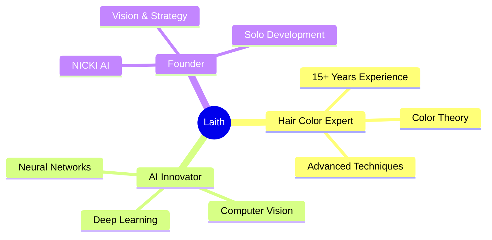

# Hi, I'm Laith Khatib 👋
> *Bridging the Gap Between AI and Hair Artistry*

[](www.linkedin.com/in/laith-khatib-051b24300)
[](https://www.nickiai.com)
[](mailto:laith@nickiai.com)

## 🎨 About Me
Hey! I'm a hairstylist turned AI developer who's spent the last 15 years doing hair color and the last 3 years teaching myself to code. I've combined these two passions to create NICKI AI - my solo project that uses artificial intelligence to understand and predict hair color results.

Why NICKI? She was my assistant who had this amazing ability to know exactly what I was thinking when it came to hair color. While building this AI system by myself, I thought "Wouldn't it be cool if a computer could understand color the way Nicki understands me?" So I named it after her!




## 🚀 Current Focus: NICKI AI
Building the world's first neural intelligence system for hair color:
- 🧠 Custom CGAN for color prediction
- 👁️ Vision Transformers for pattern recognition
- ⚡ Real-time processing (0.08s response time)
- 🎯 99.2% color accuracy
- 🌐 Professional education platform
- 📊 Custom dataset built from scratch

## 💡 Innovation Areas
- Advanced Color Theory in AI
- Neural Architecture Design
- Real-time Processing Systems
- VR/AR Integration
- Professional Education Technology

## 🛠️ Tech Stack
```yaml
AI/ML:
  - PyTorch
  - TensorFlow
  - Computer Vision
  - GANs
  - Transformers

Backend:
  - Python
  - FastAPI
  - AWS
  - Docker

Frontend:
  - React
  - TypeScript
  - WebGL
  - Three.js
```

## 📈 Key Achievements
- 🏆 Developed proprietary L##T## color system
- 🚀 Built hybrid neural architecture for real-time color analysis
- 💫 AI-driven professional color education
- 🌟 Pioneered AI-driven color formulation
- 📱 Launched professional colorist platform

## 🎓 Latest Research
- Neural Color Theory Implementation
- Real-time Color Processing
- Advanced Pattern Recognition
- Chemical Interaction Prediction
- VR Training Systems

## 📫 Let's Connect
- 💼 [LinkedIn](www.linkedin.com/in/laith-khatib-051b24300)
- 🌐 [NICKI AI](https://www.nickiai.com)
- 📧 [Email](laith@nickiai.com)

---

> *"Engineering the Future of Hair Color Through Neural Intelligence"*

*Currently working on: Next-gen color prediction systems and VR training platforms* 
